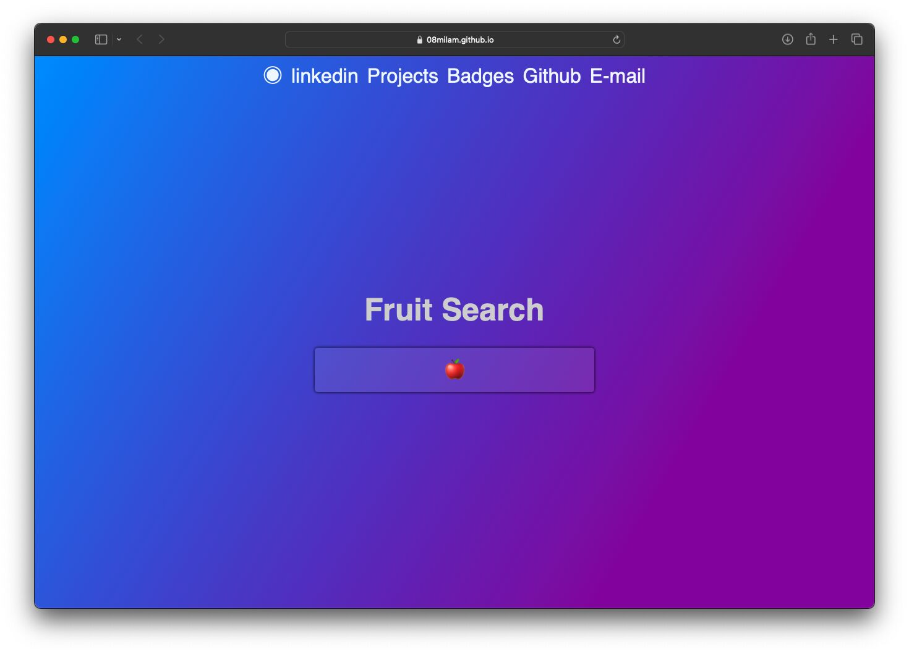

Discover the future of fruit selection with our Predictive Fruit Search. Simply start typing your desired fruit, and let our advanced algorithms suggest personalized options based on your taste preferences and nutritional needs. Say goodbye to guesswork and hello to perfect fruit every time!

HOW TO RUN 
------------------------------------
* To get started, navigate to the Fruit-Search repository on GitHub and download the files. Then, open the folder in Visual Studio Code and launch the live server extension. This action  will automatically open the project in your default web browser.

TECHNOLOGY STACK USED
------------------------------------
* HTML
* CSS
* JavaScript

